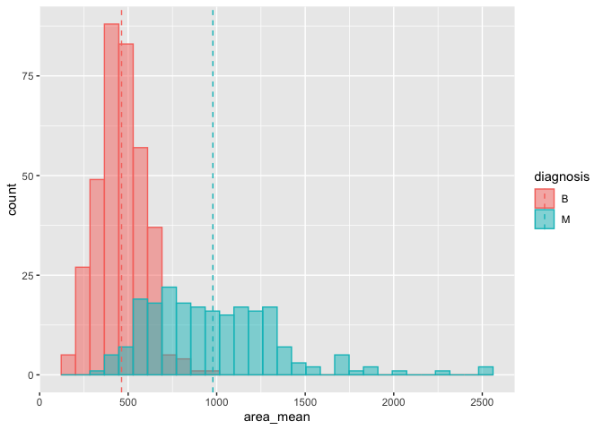
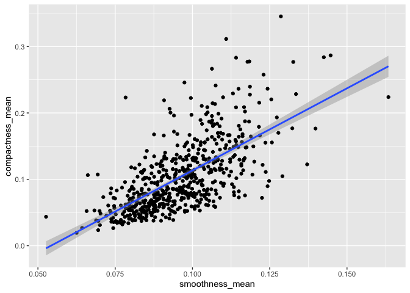
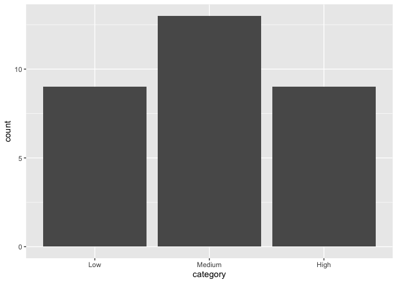

Mini-data-analysis-m2
================
William Laplante
12/10/2021

``` r
library(datateachr)
library(plyr)
library(tidyverse)
```

    ## ── Attaching packages ─────────────────────────────────────── tidyverse 1.3.1 ──

    ## ✓ ggplot2 3.3.5     ✓ purrr   0.3.4
    ## ✓ tibble  3.1.5     ✓ dplyr   1.0.7
    ## ✓ tidyr   1.1.3     ✓ stringr 1.4.0
    ## ✓ readr   2.0.2     ✓ forcats 0.5.1

    ## ── Conflicts ────────────────────────────────────────── tidyverse_conflicts() ──
    ## x dplyr::arrange()   masks plyr::arrange()
    ## x purrr::compact()   masks plyr::compact()
    ## x dplyr::count()     masks plyr::count()
    ## x dplyr::failwith()  masks plyr::failwith()
    ## x dplyr::filter()    masks stats::filter()
    ## x dplyr::id()        masks plyr::id()
    ## x dplyr::lag()       masks stats::lag()
    ## x dplyr::mutate()    masks plyr::mutate()
    ## x dplyr::rename()    masks plyr::rename()
    ## x dplyr::summarise() masks plyr::summarise()
    ## x dplyr::summarize() masks plyr::summarize()

``` r
library(DiscriMiner)
library(corrr)
```

## Task 1 : Process and summarize your data

### 1.1 : Research questions

1.  How does the area of a cancer affects the diagnosis?

2.  How strongly do smoothness and compactness correlate, and is it
    dependent on diagnosis?

3.  What is the variable in this dataset that is the best indicator of a
    malignant cancer?

4.  Is it harder to perform radius measurements on malignant cancers
    compared to benign cancers? That is, is the standard error in radius
    measurements bigger for malignant cancers?

### 1.2 : Summarizing and Graphing

#### Research question 1

We compute the summary statistics of the area of a cancer for malignant
cancers and for bening cancers. This gives us insights on the spread of
our data and where it is centered. Also, we can compare the mean and
median to see if there are significant outliers.

##### Malignant cancer - summary statistics

``` r
cancer_sample %>% filter(diagnosis == "M") %>% select(area_mean) %>% summary()
```

    ##    area_mean     
    ##  Min.   : 361.6  
    ##  1st Qu.: 705.3  
    ##  Median : 932.0  
    ##  Mean   : 978.4  
    ##  3rd Qu.:1203.8  
    ##  Max.   :2501.0

##### Benign cancer - summary statistics

``` r
sum_B = cancer_sample %>% filter(diagnosis == "B") %>% select(area_mean) %>% summary()
sum_B
```

    ##    area_mean    
    ##  Min.   :143.5  
    ##  1st Qu.:378.2  
    ##  Median :458.4  
    ##  Mean   :462.8  
    ##  3rd Qu.:551.1  
    ##  Max.   :992.1

We also compute and store the mean of area_mean for each of the two
diagnosis. This will be used later for plotting.

``` r
mu = ddply(cancer_sample, "diagnosis", summarise, grp.mean=mean(area_mean))
mu
```

    ##   diagnosis grp.mean
    ## 1         B 462.7902
    ## 2         M 978.3764

##### Graphing

Now, we can visualize the existing difference in summary statistics
between the benign cancer and malignant cancer by making a histogram for
both cases. We play on the transparency to show the small overlap
between the two histograms.

``` r
p <- ggplot(cancer_sample, aes(x=area_mean, fill=diagnosis, color=diagnosis)) + geom_histogram(position="identity", alpha=0.5)
p +   geom_vline(data=mu, aes(xintercept=grp.mean, color=diagnosis), linetype="dashed")
```

    ## `stat_bin()` using `bins = 30`. Pick better value with `binwidth`.

<!-- -->

#### Research question 2

We look into the summary statistics of smoothness and compactness. Also,
we look at the covariance and correlation between the two.

##### smoothness - summary statistics

``` r
cancer_sample %>% select(smoothness_mean) %>% summary()
```

    ##  smoothness_mean  
    ##  Min.   :0.05263  
    ##  1st Qu.:0.08637  
    ##  Median :0.09587  
    ##  Mean   :0.09636  
    ##  3rd Qu.:0.10530  
    ##  Max.   :0.16340

##### compactness - summary statistics

``` r
cancer_sample %>% select(compactness_mean) %>% summary()
```

    ##  compactness_mean 
    ##  Min.   :0.01938  
    ##  1st Qu.:0.06492  
    ##  Median :0.09263  
    ##  Mean   :0.10434  
    ##  3rd Qu.:0.13040  
    ##  Max.   :0.34540

##### Correlation between the variables

``` r
cor(cancer_sample$smoothness_mean, cancer_sample$compactness_mean)
```

    ## [1] 0.6591232

##### Graphing

Now, we make a plot illustrating the correlation between the two
variables. We add a fitted regression line to show the correlation. Note
that for now, we ignore the diagnosis component of the data.

``` r
ggplot(cancer_sample, aes(smoothness_mean, compactness_mean)) + geom_point() + geom_smooth(method=lm)
```

    ## `geom_smooth()` using formula 'y ~ x'

<!-- -->

#### Research question 3

We look at the correlation between all numerical variables in the
dataset and the diagnosis categorical variable. To do so, we convert the
diagnosis column to a numerical datatype, so that malignant (“M”)
becomes 1 and benign (“B”) becomes 0. This makes it so we can compute
the correlation matrix.

``` r
cancer_sample_numeric <- cancer_sample %>% replace(cancer_sample=="M","1") %>% replace(cancer_sample=="B","0") %>% transform(diagnosis=as.numeric(diagnosis))
cancer_sample_cormatrix = cor(cancer_sample_numeric)
```

``` r
cormatrix_df <- as_cordf(cancer_sample_cormatrix)
cormatrix_df
```

    ## # A tibble: 32 × 33
    ##    term           ID diagnosis radius_mean texture_mean perimeter_mean area_mean
    ##    <chr>       <dbl>     <dbl>       <dbl>        <dbl>          <dbl>     <dbl>
    ##  1 ID       NA          0.0398      0.0746       0.0998         0.0732    0.0969
    ##  2 diagnos…  3.98e-2   NA           0.730        0.415          0.743     0.709 
    ##  3 radius_…  7.46e-2    0.730      NA            0.324          0.998     0.987 
    ##  4 texture…  9.98e-2    0.415       0.324       NA              0.330     0.321 
    ##  5 perimet…  7.32e-2    0.743       0.998        0.330         NA         0.987 
    ##  6 area_me…  9.69e-2    0.709       0.987        0.321          0.987    NA     
    ##  7 smoothn… -1.30e-2    0.359       0.171       -0.0234         0.207     0.177 
    ##  8 compact…  9.57e-5    0.597       0.506        0.237          0.557     0.499 
    ##  9 concavi…  5.01e-2    0.696       0.677        0.302          0.716     0.686 
    ## 10 concave…  4.42e-2    0.777       0.823        0.293          0.851     0.823 
    ## # … with 22 more rows, and 26 more variables: smoothness_mean <dbl>,
    ## #   compactness_mean <dbl>, concavity_mean <dbl>, concave_points_mean <dbl>,
    ## #   symmetry_mean <dbl>, fractal_dimension_mean <dbl>, radius_se <dbl>,
    ## #   texture_se <dbl>, perimeter_se <dbl>, area_se <dbl>, smoothness_se <dbl>,
    ## #   compactness_se <dbl>, concavity_se <dbl>, concave_points_se <dbl>,
    ## #   symmetry_se <dbl>, fractal_dimension_se <dbl>, radius_worst <dbl>,
    ## #   texture_worst <dbl>, perimeter_worst <dbl>, area_worst <dbl>, …

We can then split the correlation coefficients into 3 categories : High,
Medium and Low. This allows us to understand the influence of the
existing variables on the cancer diagnosis. We illustrate this splitting
using a bar graph.

``` r
category_corr <- cormatrix_df %>% mutate(category=cut(diagnosis, breaks=c(-Inf,0.33, 0.66, Inf), labels=c("Low", "Medium", "High"))) %>% select(term, diagnosis, category) %>% filter(!is.na(diagnosis)) %>% rename(variable=term, corr_with_diagnosis=diagnosis)
category_corr
```

    ## # A tibble: 31 × 3
    ##    variable            corr_with_diagnosis category
    ##    <chr>                             <dbl> <fct>   
    ##  1 ID                               0.0398 Low     
    ##  2 radius_mean                      0.730  High    
    ##  3 texture_mean                     0.415  Medium  
    ##  4 perimeter_mean                   0.743  High    
    ##  5 area_mean                        0.709  High    
    ##  6 smoothness_mean                  0.359  Medium  
    ##  7 compactness_mean                 0.597  Medium  
    ##  8 concavity_mean                   0.696  High    
    ##  9 concave_points_mean              0.777  High    
    ## 10 symmetry_mean                    0.330  Medium  
    ## # … with 21 more rows

Here, the graph shows the number of variables falling under each
category for the correlation coefficient with the cancer diagnosis.

``` r
ggplot(category_corr, aes(x=category)) + geom_bar()
```

<!-- -->

What is the variable in this dataset that is the best indicator of a
malignant cancer?
