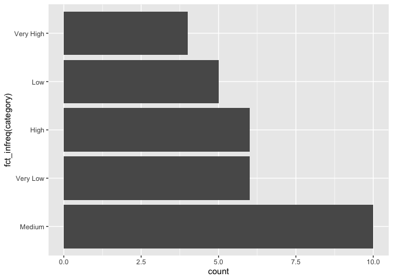
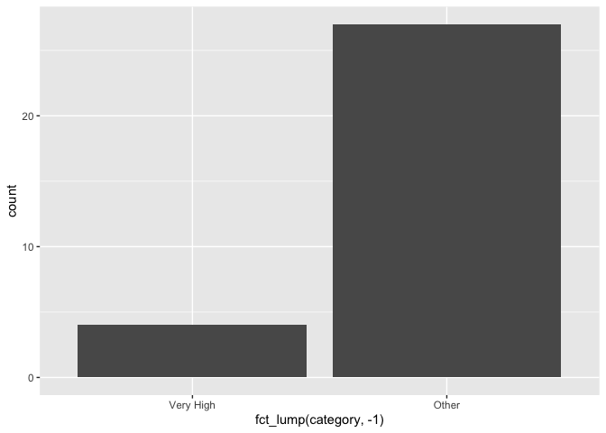

Mini-data-analysis-m3
================
William Laplante
20/10/2021

## Setup

``` r
library(datateachr)
library(plyr)
library(tidyverse)
```

    ## ── Attaching packages ─────────────────────────────────────── tidyverse 1.3.1 ──

    ## ✓ ggplot2 3.3.5     ✓ purrr   0.3.4
    ## ✓ tibble  3.1.5     ✓ dplyr   1.0.7
    ## ✓ tidyr   1.1.3     ✓ stringr 1.4.0
    ## ✓ readr   2.0.2     ✓ forcats 0.5.1

    ## ── Conflicts ────────────────────────────────────────── tidyverse_conflicts() ──
    ## x dplyr::arrange()   masks plyr::arrange()
    ## x purrr::compact()   masks plyr::compact()
    ## x dplyr::count()     masks plyr::count()
    ## x dplyr::failwith()  masks plyr::failwith()
    ## x dplyr::filter()    masks stats::filter()
    ## x dplyr::id()        masks plyr::id()
    ## x dplyr::lag()       masks stats::lag()
    ## x dplyr::mutate()    masks plyr::mutate()
    ## x dplyr::rename()    masks plyr::rename()
    ## x dplyr::summarise() masks plyr::summarise()
    ## x dplyr::summarize() masks plyr::summarize()

``` r
library(DiscriMiner)
library(corrr)
library(forcats)
library(broom)
library(here)
```

    ## here() starts at /Users/william/Documents/UBC/STAT 545A/Mini Data Analysis/mda-williamlaplante

    ## 
    ## Attaching package: 'here'

    ## The following object is masked from 'package:plyr':
    ## 
    ##     here

In milestone 2, we chose two research questions:

1.  How does the area of a cancer affects the diagnosis?

2.  What is the variable in this dataset that is the best indicator of a
    malignant cancer?

## Exercise 1 : Special Data Types

#### Task 1

Here, we take the correlation matrix computed in the previous milestone,
and we divide into categories the correlation values for the diagnosis
column. We then reorder categories using fct_infreq() and plot the bar
graph with this new reordering. This is helpful to visualize which
category is dominant in our data and which category is the least
present. Clearly, we see that the category that is the least present is
“very high”, meaning most of our variables don’t have a strong
correlation with the diagnosis. Also the correlation category that is
most present is “medium”.

``` r
#we compute the correlation matrix for the cancer_sample dataset. 
cancer_sample_numeric <- cancer_sample %>% replace(cancer_sample=="M","1") %>% replace(cancer_sample=="B","0") %>% transform(diagnosis=as.numeric(diagnosis))
cancer_sample_cormatrix = cor(cancer_sample_numeric)

#we store as a dataframe the correlation matrix
cormatrix_df <- as_cordf(cancer_sample_cormatrix)

#we break the correlation values into categories for the diagnosis column.
category_corr <- cormatrix_df %>% mutate(category=cut(diagnosis, breaks=c(-Inf, 0.2, 0.4, 0.6, 0.75, Inf), labels=c("Very Low", "Low", "Medium", "High", "Very High"))) %>% select(term, diagnosis, category) %>% filter(!is.na(diagnosis)) %>% rename(variable=term, corr_with_diagnosis=diagnosis)

#now we plot the bar graph for the correlation categories in order using the forcats package.
ggplot(category_corr, aes(x = fct_infreq(category))) + geom_bar() + coord_flip()
```

<!-- -->

#### Task 2

We now regroup our factor levels into two categories ; one will contain
the variables with a “very high” correlation with the diagnosis and the
other category will be labeled “other” and contain the remaining
variables that won’t be used for research purposes. This is useful to
show how many variables will be discarded vs how many will be kept for
future analyses.

``` r
ggplot(category_corr, aes(x = fct_lump(category, -1))) + geom_bar()
```

<!-- -->

## Exercise 2 : Modelling

#### 2.0

We now choose our final research question and define the variable of
interest. Note that here, we change a bit the initial research question,
since the original question can already be answered through our previous
analysis.

Research question : If we create two models, one trained with the
variables that have “Very High” correlation with the diagnosis, and
another with the variables falling under the “other” category, how do
these two models compare?

Variable of Interest : Accuracy of model (based on the diagnosis
variable)

#### 2.1

Now, we extract the variables from the “very high” and “other”
categories :

``` r
Other_df <- category_corr %>% filter(category != "Very High") 

Very_High_df <- category_corr %>% filter(category=="Very High")
```

We then make two dataframes containing the data for these two variables.
We also convert the column diagnosis to numerical by mapping “M” to 1
and “B” to 0.

``` r
X_other <- cancer_sample %>% replace(cancer_sample=="M", "1") %>% replace(cancer_sample=="B", "1") %>% transform(diagnosis=as.numeric(diagnosis)) %>% select(Other_df$variable, diagnosis) %>% select(-ID)    

X_very_high <- cancer_sample %>% replace(cancer_sample=="M", "1") %>% replace(cancer_sample=="B", "1") %>% transform(diagnosis=as.numeric(diagnosis)) %>% select(Very_High_df$variable, diagnosis) 
```

Finally, we use tidyverse’s lm() function to perform multivariate linear
regression using both datasets as inputs (data with “very high”
correlation and “other” correlation). Both models output a value between
0 and 1, which can be interpreted as the likelihood of a cancer being
malignant.

``` r
model_other = lm(diagnosis~.,X_other)
model_very_high = lm(diagnosis~., X_very_high)
```

#### 2.2

We now look at the standard error, statistic, and p value of our
variables in both models. Then, we assess the accuracy of our models by
looking at the adjusted R-squared.

``` r
tidy(model_other)
```

    ## Warning in summary.lm(x): essentially perfect fit: summary may be unreliable

    ## # A tibble: 27 × 5
    ##    term                    estimate std.error statistic    p.value
    ##    <chr>                      <dbl>     <dbl>     <dbl>      <dbl>
    ##  1 (Intercept)             1   e+ 0  3.75e-16  2.67e+15 0         
    ##  2 radius_mean            -4.45e-16  1.35e-16 -3.29e+ 0 0.00108   
    ##  3 texture_mean            5.43e-18  6.98e-18  7.78e- 1 0.437     
    ##  4 perimeter_mean          5.51e-17  2.09e-17  2.64e+ 0 0.00854   
    ##  5 area_mean               1.44e-18  3.03e-19  4.76e+ 0 0.00000245
    ##  6 smoothness_mean         2.84e-15  1.69e-15  1.68e+ 0 0.0936    
    ##  7 compactness_mean       -2.40e-15  1.18e-15 -2.04e+ 0 0.0421    
    ##  8 concavity_mean         -1.70e-15  6.48e-16 -2.62e+ 0 0.00913   
    ##  9 symmetry_mean           8.46e-16  6.52e-16  1.30e+ 0 0.195     
    ## 10 fractal_dimension_mean -4.01e-15  4.96e-15 -8.08e- 1 0.419     
    ## # … with 17 more rows

``` r
tidy(model_very_high)
```

    ## Warning in summary.lm(x): essentially perfect fit: summary may be unreliable

    ## # A tibble: 5 × 5
    ##   term                  estimate std.error statistic  p.value
    ##   <chr>                    <dbl>     <dbl>     <dbl>    <dbl>
    ## 1 (Intercept)           1   e+ 0  4.18e-17  2.39e+16 0       
    ## 2 concave_points_mean  -2.20e-16  6.55e-16 -3.36e- 1 0.737   
    ## 3 radius_worst          6.54e-17  1.84e-17  3.55e+ 0 0.000421
    ## 4 perimeter_worst      -1.02e-17  2.87e-18 -3.54e+ 0 0.000439
    ## 5 concave_points_worst  2.48e-16  3.49e-16  7.12e- 1 0.477

``` r
summary(model_other)$adj.r.squared
```

    ## Warning in summary.lm(model_other): essentially perfect fit: summary may be
    ## unreliable

    ## [1] 0.4888361

``` r
summary(model_very_high)$adj.r.squared
```

    ## Warning in summary.lm(model_very_high): essentially perfect fit: summary may be
    ## unreliable

    ## [1] 0.4946101

These adjusted R squared values demonstrate that our model aren’t so
good, and that we should probably look into non-linear models for this
kind of problem.

## Exercise 3 : Reading and writing data

#### 3.1

We take a summary table from milestone 2, and write it as a csv file in
the output folder. To do so, we use the here() function.

``` r
category_corr #this is the summary table from milestone 2
```

    ## # A tibble: 31 × 3
    ##    variable            corr_with_diagnosis category 
    ##    <chr>                             <dbl> <fct>    
    ##  1 ID                               0.0398 Very Low 
    ##  2 radius_mean                      0.730  High     
    ##  3 texture_mean                     0.415  Medium   
    ##  4 perimeter_mean                   0.743  High     
    ##  5 area_mean                        0.709  High     
    ##  6 smoothness_mean                  0.359  Low      
    ##  7 compactness_mean                 0.597  Medium   
    ##  8 concavity_mean                   0.696  High     
    ##  9 concave_points_mean              0.777  Very High
    ## 10 symmetry_mean                    0.330  Low      
    ## # … with 21 more rows

``` r
write.csv(category_corr, here("output", "category_corr.csv")) #we write to the output folder the category_corr dataframe in a csv format.
```

Robustness : This code should work even if we move our mini data
analysis folder in some other location on my computer, since the here()
function will always make it so we have access to the current path where
the project folder is located.

Reproducibility : Deleting the csv file and knitting this Rmd file
remakes the csv file in the output folder.

#### 3.2

We now save our two models in R binary files in the output folder. We
use the saveRDS() function to save our file, and we use the here()
function for the robustness and reproducibility criterias explained
above.

``` r
saveRDS(model_other, here("output", "model_other.rds"))
saveRDS(model_very_high, here("output", "model_very_high.rds"))
```

We check that we can load our models properly and that everything works
fine :

``` r
tidy(readRDS(here("output", "model_very_high.rds")))
```

    ## Warning in summary.lm(x): essentially perfect fit: summary may be unreliable

    ## # A tibble: 5 × 5
    ##   term                  estimate std.error statistic  p.value
    ##   <chr>                    <dbl>     <dbl>     <dbl>    <dbl>
    ## 1 (Intercept)           1   e+ 0  4.18e-17  2.39e+16 0       
    ## 2 concave_points_mean  -2.20e-16  6.55e-16 -3.36e- 1 0.737   
    ## 3 radius_worst          6.54e-17  1.84e-17  3.55e+ 0 0.000421
    ## 4 perimeter_worst      -1.02e-17  2.87e-18 -3.54e+ 0 0.000439
    ## 5 concave_points_worst  2.48e-16  3.49e-16  7.12e- 1 0.477

``` r
tidy(readRDS(here("output", "model_other.rds")))
```

    ## Warning in summary.lm(x): essentially perfect fit: summary may be unreliable

    ## # A tibble: 27 × 5
    ##    term                    estimate std.error statistic    p.value
    ##    <chr>                      <dbl>     <dbl>     <dbl>      <dbl>
    ##  1 (Intercept)             1   e+ 0  3.75e-16  2.67e+15 0         
    ##  2 radius_mean            -4.45e-16  1.35e-16 -3.29e+ 0 0.00108   
    ##  3 texture_mean            5.43e-18  6.98e-18  7.78e- 1 0.437     
    ##  4 perimeter_mean          5.51e-17  2.09e-17  2.64e+ 0 0.00854   
    ##  5 area_mean               1.44e-18  3.03e-19  4.76e+ 0 0.00000245
    ##  6 smoothness_mean         2.84e-15  1.69e-15  1.68e+ 0 0.0936    
    ##  7 compactness_mean       -2.40e-15  1.18e-15 -2.04e+ 0 0.0421    
    ##  8 concavity_mean         -1.70e-15  6.48e-16 -2.62e+ 0 0.00913   
    ##  9 symmetry_mean           8.46e-16  6.52e-16  1.30e+ 0 0.195     
    ## 10 fractal_dimension_mean -4.01e-15  4.96e-15 -8.08e- 1 0.419     
    ## # … with 17 more rows

We see that we get the same models as before. Therefore, we can
successfully retrieve our models if needed using the readRDS() function.
