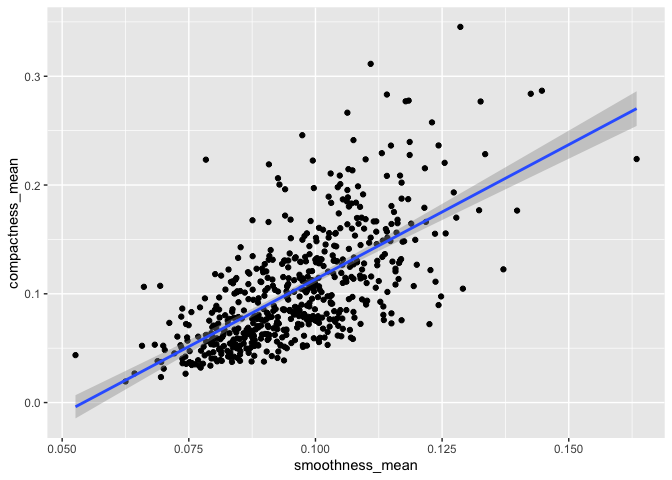
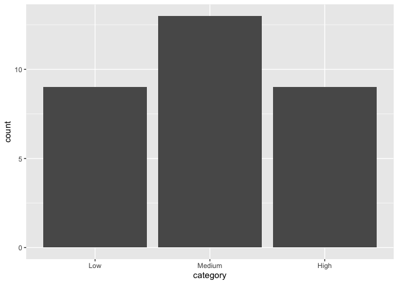
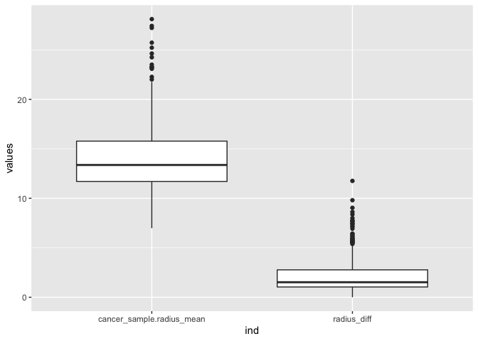

Mini-data-analysis-m2
================
William Laplante
12/10/2021

``` r
library(datateachr)
library(plyr)
library(tidyverse)
```

    ## ── Attaching packages ─────────────────────────────────────── tidyverse 1.3.1 ──

    ## ✓ ggplot2 3.3.5     ✓ purrr   0.3.4
    ## ✓ tibble  3.1.5     ✓ dplyr   1.0.7
    ## ✓ tidyr   1.1.3     ✓ stringr 1.4.0
    ## ✓ readr   2.0.2     ✓ forcats 0.5.1

    ## ── Conflicts ────────────────────────────────────────── tidyverse_conflicts() ──
    ## x dplyr::arrange()   masks plyr::arrange()
    ## x purrr::compact()   masks plyr::compact()
    ## x dplyr::count()     masks plyr::count()
    ## x dplyr::failwith()  masks plyr::failwith()
    ## x dplyr::filter()    masks stats::filter()
    ## x dplyr::id()        masks plyr::id()
    ## x dplyr::lag()       masks stats::lag()
    ## x dplyr::mutate()    masks plyr::mutate()
    ## x dplyr::rename()    masks plyr::rename()
    ## x dplyr::summarise() masks plyr::summarise()
    ## x dplyr::summarize() masks plyr::summarize()

``` r
library(DiscriMiner)
library(corrr)
```

## Task 1 : Process and summarize your data

### 1.1 : Research questions

1.  How does the area of a cancer affects the diagnosis?

2.  How strongly do smoothness and compactness correlate, and is it
    dependent on diagnosis?

3.  What is the variable in this dataset that is the best indicator of a
    malignant cancer?

4.  Is it harder to perform radius measurements on malignant cancers
    compared to benign cancers? That is, is the standard error in radius
    measurements bigger for malignant cancers?

### 1.2 : Summarizing and Graphing

#### Research question 1

We compute the summary statistics of the area of a cancer for malignant
cancers and for bening cancers. This gives us insights on the spread of
our data and where it is centered. Also, we can compare the mean and
median to see if there are significant outliers.

##### Malignant cancer - summary statistics

``` r
cancer_sample %>% filter(diagnosis == "M") %>% select(area_mean) %>% summary()
```

    ##    area_mean     
    ##  Min.   : 361.6  
    ##  1st Qu.: 705.3  
    ##  Median : 932.0  
    ##  Mean   : 978.4  
    ##  3rd Qu.:1203.8  
    ##  Max.   :2501.0

##### Benign cancer - summary statistics

``` r
sum_B = cancer_sample %>% filter(diagnosis == "B") %>% select(area_mean) %>% summary()
sum_B
```

    ##    area_mean    
    ##  Min.   :143.5  
    ##  1st Qu.:378.2  
    ##  Median :458.4  
    ##  Mean   :462.8  
    ##  3rd Qu.:551.1  
    ##  Max.   :992.1

We also compute and store the mean of area_mean for each of the two
diagnosis. This will be used later for plotting.

``` r
mu = ddply(cancer_sample, "diagnosis", summarise, grp.mean=mean(area_mean))
mu
```

    ##   diagnosis grp.mean
    ## 1         B 462.7902
    ## 2         M 978.3764

##### Graphing

Now, we can visualize the existing difference in summary statistics
between the benign cancer and malignant cancer by making a histogram for
both cases. We play on the transparency to show the small overlap
between the two histograms.

``` r
p <- ggplot(cancer_sample, aes(x=area_mean, fill=diagnosis, color=diagnosis)) + geom_histogram(position="identity", alpha=0.5)
p +   geom_vline(data=mu, aes(xintercept=grp.mean, color=diagnosis), linetype="dashed")
```

    ## `stat_bin()` using `bins = 30`. Pick better value with `binwidth`.

<!-- -->

#### Research question 2

We look into the summary statistics of smoothness and compactness. Also,
we look at the covariance and correlation between the two.

##### smoothness - summary statistics

``` r
cancer_sample %>% select(smoothness_mean) %>% summary()
```

    ##  smoothness_mean  
    ##  Min.   :0.05263  
    ##  1st Qu.:0.08637  
    ##  Median :0.09587  
    ##  Mean   :0.09636  
    ##  3rd Qu.:0.10530  
    ##  Max.   :0.16340

##### compactness - summary statistics

``` r
cancer_sample %>% select(compactness_mean) %>% summary()
```

    ##  compactness_mean 
    ##  Min.   :0.01938  
    ##  1st Qu.:0.06492  
    ##  Median :0.09263  
    ##  Mean   :0.10434  
    ##  3rd Qu.:0.13040  
    ##  Max.   :0.34540

##### Correlation between the variables

``` r
cor(cancer_sample$smoothness_mean, cancer_sample$compactness_mean)
```

    ## [1] 0.6591232

##### Graphing

Now, we make a plot illustrating the correlation between the two
variables. We add a fitted regression line to show the correlation. Note
that for now, we ignore the diagnosis component of the data.

``` r
ggplot(cancer_sample, aes(smoothness_mean, compactness_mean)) + geom_point() + geom_smooth(method=lm)
```

    ## `geom_smooth()` using formula 'y ~ x'

<!-- -->

#### Research question 3

We look at the correlation between all numerical variables in the
dataset and the diagnosis categorical variable. To do so, we convert the
diagnosis column to a numerical datatype, so that malignant (“M”)
becomes 1 and benign (“B”) becomes 0. This makes it so we can compute
the correlation matrix.

``` r
cancer_sample_numeric <- cancer_sample %>% replace(cancer_sample=="M","1") %>% replace(cancer_sample=="B","0") %>% transform(diagnosis=as.numeric(diagnosis))
cancer_sample_cormatrix = cor(cancer_sample_numeric)
```

``` r
cormatrix_df <- as_cordf(cancer_sample_cormatrix)
cormatrix_df
```

    ## # A tibble: 32 × 33
    ##    term           ID diagnosis radius_mean texture_mean perimeter_mean area_mean
    ##    <chr>       <dbl>     <dbl>       <dbl>        <dbl>          <dbl>     <dbl>
    ##  1 ID       NA          0.0398      0.0746       0.0998         0.0732    0.0969
    ##  2 diagnos…  3.98e-2   NA           0.730        0.415          0.743     0.709 
    ##  3 radius_…  7.46e-2    0.730      NA            0.324          0.998     0.987 
    ##  4 texture…  9.98e-2    0.415       0.324       NA              0.330     0.321 
    ##  5 perimet…  7.32e-2    0.743       0.998        0.330         NA         0.987 
    ##  6 area_me…  9.69e-2    0.709       0.987        0.321          0.987    NA     
    ##  7 smoothn… -1.30e-2    0.359       0.171       -0.0234         0.207     0.177 
    ##  8 compact…  9.57e-5    0.597       0.506        0.237          0.557     0.499 
    ##  9 concavi…  5.01e-2    0.696       0.677        0.302          0.716     0.686 
    ## 10 concave…  4.42e-2    0.777       0.823        0.293          0.851     0.823 
    ## # … with 22 more rows, and 26 more variables: smoothness_mean <dbl>,
    ## #   compactness_mean <dbl>, concavity_mean <dbl>, concave_points_mean <dbl>,
    ## #   symmetry_mean <dbl>, fractal_dimension_mean <dbl>, radius_se <dbl>,
    ## #   texture_se <dbl>, perimeter_se <dbl>, area_se <dbl>, smoothness_se <dbl>,
    ## #   compactness_se <dbl>, concavity_se <dbl>, concave_points_se <dbl>,
    ## #   symmetry_se <dbl>, fractal_dimension_se <dbl>, radius_worst <dbl>,
    ## #   texture_worst <dbl>, perimeter_worst <dbl>, area_worst <dbl>, …

We can then split the correlation coefficients into 3 categories : High,
Medium and Low. This allows us to understand the influence of the
existing variables on the cancer diagnosis. We illustrate this splitting
using a bar graph.

``` r
category_corr <- cormatrix_df %>% mutate(category=cut(diagnosis, breaks=c(-Inf,0.33, 0.66, Inf), labels=c("Low", "Medium", "High"))) %>% select(term, diagnosis, category) %>% filter(!is.na(diagnosis)) %>% rename(variable=term, corr_with_diagnosis=diagnosis)
category_corr
```

    ## # A tibble: 31 × 3
    ##    variable            corr_with_diagnosis category
    ##    <chr>                             <dbl> <fct>   
    ##  1 ID                               0.0398 Low     
    ##  2 radius_mean                      0.730  High    
    ##  3 texture_mean                     0.415  Medium  
    ##  4 perimeter_mean                   0.743  High    
    ##  5 area_mean                        0.709  High    
    ##  6 smoothness_mean                  0.359  Medium  
    ##  7 compactness_mean                 0.597  Medium  
    ##  8 concavity_mean                   0.696  High    
    ##  9 concave_points_mean              0.777  High    
    ## 10 symmetry_mean                    0.330  Medium  
    ## # … with 21 more rows

Here, the graph shows the number of variables falling under each
category for the correlation coefficient with the cancer diagnosis.

``` r
ggplot(category_corr, aes(x=category)) + geom_bar()
```

<!-- -->

#### Research question 4

For this research question, we can create a new variable, which would be
the absolute difference between the mean and the worst measurement for
each diagnosis. If the worst is far from the mean, it tells us that
there is a high variance between measurements of the same variable.

``` r
data_mean <- cancer_sample %>% select(radius_mean : fractal_dimension_mean) 

data_worse <- cancer_sample %>% select(radius_worst : fractal_dimension_worst)

radius_diff = rename_with(abs(data_mean-data_worse), ~gsub("_mean", "_diff", .x, fixed=TRUE)) %>% select(radius_diff)
head(radius_diff)
```

    ##   radius_diff
    ## 1        7.39
    ## 2        4.42
    ## 3        3.88
    ## 4        3.49
    ## 5        2.25
    ## 6        3.02

We can then compute some statistics to see how variable radius
measurements are :

``` r
summary(radius_diff$radius_diff)
```

    ##    Min. 1st Qu.  Median    Mean 3rd Qu.    Max. 
    ##   0.000   1.040   1.520   2.142   2.770  11.760

``` r
summary(data_mean$radius_mean)
```

    ##    Min. 1st Qu.  Median    Mean 3rd Qu.    Max. 
    ##   6.981  11.700  13.370  14.127  15.780  28.110

Doing so gives us input on the range of radius measurements, i.e. how
precise the given values for radius_mean are.We can visualize this by
using a boxplot :

``` r
radius_df = data.frame(cancer_sample$radius_mean, radius_diff)
ggplot(stack(radius_df), aes(x=ind, y=values)) + geom_boxplot()
```

<!-- -->

### 1.3 : Progress on research questions

All of my research questions have been explored enough for me to have an
intuitive answer. In other words, I reached a point where I could argue
and defend my answers, but only using graphs and basic arguments. The
next step will be to solidify my position regarding the research
questions using statistical tools in hypothesis testing. For instance,
in my first research question, it is clear that the distribution of
cancer area for malignant and benign diagnosis are different. But, to
claim there is a significant enough difference between the two
distribution, I need some sort of hypothesis testing. The same applies
for the other research questions. Also, for the last research questions,
I realized that it would be possible to extend the question to more than
just the radius. This would provide insights on which variables are the
easiest to measure. For me, the third research question is the one
yielding the most interesting results, since it provides insights on
which variables are the best to predict the diagnosis of a cancer.
Having an answer to this research question is certainly very useful for
modern medecine.

## Task 2 : Tidy your data

### Task 2.1

We select 2 columns of mean, se and worst along with the diagnosis
column. This gives us a subset of the data to analyze which,
structurally speaking, represents the whole dataset. We see that this
data is not exactly tidy, since some columns are different statistics
(mean, standard deviation, worst) of the same measurement (radius,
texture). This is actually the “wide” version of our data.

``` r
data_subset <- select(cancer_sample, diagnosis:texture_mean, radius_se:texture_se, radius_worst:texture_worst)
data_subset
```

    ## # A tibble: 569 × 7
    ##    diagnosis radius_mean texture_mean radius_se texture_se radius_worst
    ##    <chr>           <dbl>        <dbl>     <dbl>      <dbl>        <dbl>
    ##  1 M                18.0         10.4     1.10       0.905         25.4
    ##  2 M                20.6         17.8     0.544      0.734         25.0
    ##  3 M                19.7         21.2     0.746      0.787         23.6
    ##  4 M                11.4         20.4     0.496      1.16          14.9
    ##  5 M                20.3         14.3     0.757      0.781         22.5
    ##  6 M                12.4         15.7     0.334      0.890         15.5
    ##  7 M                18.2         20.0     0.447      0.773         22.9
    ##  8 M                13.7         20.8     0.584      1.38          17.1
    ##  9 M                13           21.8     0.306      1.00          15.5
    ## 10 M                12.5         24.0     0.298      1.60          15.1
    ## # … with 559 more rows, and 1 more variable: texture_worst <dbl>

### Task 2.2

To make our data tidy, we make it “long” so that every column is a
variable, every row is an observation, and every cell is a single value.

``` r
data_subset %>% pivot_longer(!diagnosis, names_to=c("Measurement", "Statistic"), names_sep="_", values_to = "Value")
```

    ## # A tibble: 3,414 × 4
    ##    diagnosis Measurement Statistic  Value
    ##    <chr>     <chr>       <chr>      <dbl>
    ##  1 M         radius      mean      18.0  
    ##  2 M         texture     mean      10.4  
    ##  3 M         radius      se         1.10 
    ##  4 M         texture     se         0.905
    ##  5 M         radius      worst     25.4  
    ##  6 M         texture     worst     17.3  
    ##  7 M         radius      mean      20.6  
    ##  8 M         texture     mean      17.8  
    ##  9 M         radius      se         0.544
    ## 10 M         texture     se         0.734
    ## # … with 3,404 more rows

### Task 2.3

The most interesting research questions for me are the first one and the
third one because they complement well themselves, and because in
theory, providing an answer to these problems would be beneficial for
cancer predictions. Hence, we pick those for milestone 3. The version of
the data we pick is as follows, where we perform some operations on the
dataset for later usage.

For research question 1, we have the area_mean for both diagnosis:

``` r
area_mean_M = cancer_sample %>% filter(diagnosis == "M") %>% select(area_mean)
```

``` r
area_mean_B = cancer_sample %>% filter(diagnosis == "B") %>% select(area_mean)
```

For research question 2 (we already performed the operations above), we
have 3 versions of the data we will use.

This is the data with M mapped to 1 and B mapped to 0.

``` r
head(cancer_sample_numeric)
```

    ##         ID diagnosis radius_mean texture_mean perimeter_mean area_mean
    ## 1   842302         1       17.99        10.38         122.80    1001.0
    ## 2   842517         1       20.57        17.77         132.90    1326.0
    ## 3 84300903         1       19.69        21.25         130.00    1203.0
    ## 4 84348301         1       11.42        20.38          77.58     386.1
    ## 5 84358402         1       20.29        14.34         135.10    1297.0
    ## 6   843786         1       12.45        15.70          82.57     477.1
    ##   smoothness_mean compactness_mean concavity_mean concave_points_mean
    ## 1         0.11840          0.27760         0.3001             0.14710
    ## 2         0.08474          0.07864         0.0869             0.07017
    ## 3         0.10960          0.15990         0.1974             0.12790
    ## 4         0.14250          0.28390         0.2414             0.10520
    ## 5         0.10030          0.13280         0.1980             0.10430
    ## 6         0.12780          0.17000         0.1578             0.08089
    ##   symmetry_mean fractal_dimension_mean radius_se texture_se perimeter_se
    ## 1        0.2419                0.07871    1.0950     0.9053        8.589
    ## 2        0.1812                0.05667    0.5435     0.7339        3.398
    ## 3        0.2069                0.05999    0.7456     0.7869        4.585
    ## 4        0.2597                0.09744    0.4956     1.1560        3.445
    ## 5        0.1809                0.05883    0.7572     0.7813        5.438
    ## 6        0.2087                0.07613    0.3345     0.8902        2.217
    ##   area_se smoothness_se compactness_se concavity_se concave_points_se
    ## 1  153.40      0.006399        0.04904      0.05373           0.01587
    ## 2   74.08      0.005225        0.01308      0.01860           0.01340
    ## 3   94.03      0.006150        0.04006      0.03832           0.02058
    ## 4   27.23      0.009110        0.07458      0.05661           0.01867
    ## 5   94.44      0.011490        0.02461      0.05688           0.01885
    ## 6   27.19      0.007510        0.03345      0.03672           0.01137
    ##   symmetry_se fractal_dimension_se radius_worst texture_worst perimeter_worst
    ## 1     0.03003             0.006193        25.38         17.33          184.60
    ## 2     0.01389             0.003532        24.99         23.41          158.80
    ## 3     0.02250             0.004571        23.57         25.53          152.50
    ## 4     0.05963             0.009208        14.91         26.50           98.87
    ## 5     0.01756             0.005115        22.54         16.67          152.20
    ## 6     0.02165             0.005082        15.47         23.75          103.40
    ##   area_worst smoothness_worst compactness_worst concavity_worst
    ## 1     2019.0           0.1622            0.6656          0.7119
    ## 2     1956.0           0.1238            0.1866          0.2416
    ## 3     1709.0           0.1444            0.4245          0.4504
    ## 4      567.7           0.2098            0.8663          0.6869
    ## 5     1575.0           0.1374            0.2050          0.4000
    ## 6      741.6           0.1791            0.5249          0.5355
    ##   concave_points_worst symmetry_worst fractal_dimension_worst
    ## 1               0.2654         0.4601                 0.11890
    ## 2               0.1860         0.2750                 0.08902
    ## 3               0.2430         0.3613                 0.08758
    ## 4               0.2575         0.6638                 0.17300
    ## 5               0.1625         0.2364                 0.07678
    ## 6               0.1741         0.3985                 0.12440

This is the correlation matrix of the cancer_sample_numeric data.

``` r
head(cormatrix_df)
```

    ## # A tibble: 6 × 33
    ##   term                ID diagnosis radius_mean texture_mean perimeter_mean area_mean
    ##   <chr>            <dbl>     <dbl>       <dbl>        <dbl>          <dbl>     <dbl>
    ## 1 ID             NA         0.0398      0.0746       0.0998         0.0732    0.0969
    ## 2 diagnosis       0.0398   NA           0.730        0.415          0.743     0.709 
    ## 3 radius_mean     0.0746    0.730      NA            0.324          0.998     0.987 
    ## 4 texture_mean    0.0998    0.415       0.324       NA              0.330     0.321 
    ## 5 perimeter_mean  0.0732    0.743       0.998        0.330         NA         0.987 
    ## 6 area_mean       0.0969    0.709       0.987        0.321          0.987    NA     
    ## # … with 26 more variables: smoothness_mean <dbl>, compactness_mean <dbl>,
    ## #   concavity_mean <dbl>, concave_points_mean <dbl>, symmetry_mean <dbl>,
    ## #   fractal_dimension_mean <dbl>, radius_se <dbl>, texture_se <dbl>,
    ## #   perimeter_se <dbl>, area_se <dbl>, smoothness_se <dbl>,
    ## #   compactness_se <dbl>, concavity_se <dbl>, concave_points_se <dbl>,
    ## #   symmetry_se <dbl>, fractal_dimension_se <dbl>, radius_worst <dbl>,
    ## #   texture_worst <dbl>, perimeter_worst <dbl>, area_worst <dbl>, …

This is the categorized version of the cormatrix_df data for the
diagnosis column.

``` r
head(category_corr)
```

    ## # A tibble: 6 × 3
    ##   variable        corr_with_diagnosis category
    ##   <chr>                         <dbl> <fct>   
    ## 1 ID                           0.0398 Low     
    ## 2 radius_mean                  0.730  High    
    ## 3 texture_mean                 0.415  Medium  
    ## 4 perimeter_mean               0.743  High    
    ## 5 area_mean                    0.709  High    
    ## 6 smoothness_mean              0.359  Medium
